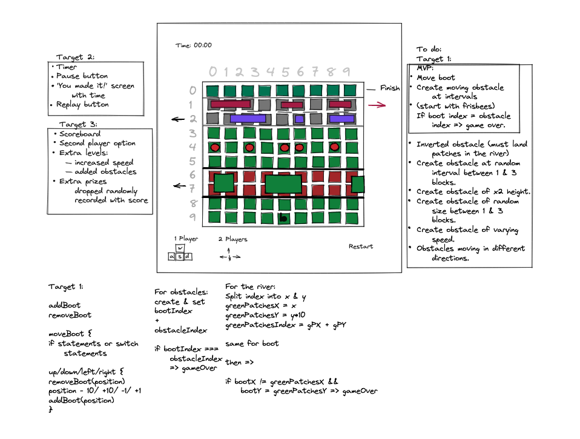

# General Assembly Project 1

## Table of Contents
* [Description](#description)
    - [Deployment Link](#deployment-link)
    - [Code Installation](#code-installation)
    - [Timeframe and Working Team](#timeframe-and-working-team)
    - [Technologies Used](#technologies-used)
    - [Brief](#brief)
* [Planning](#planning)
* [Build Process](#build-process)
    - [The Grid](#the-grid)
    - [The Player](#the-player)
    - [The Obstacles](#the-obstacles)
    - [Levels, Winning/Losing and Grid Design](#levels-winninglosing-and-grid-design)
* [Challenges](#challenges)
* [Wins](#wins)
* [Key Learnings](#key-learnings)
* [Bugs](#bugs)
* [Future Improvements](#future-improvements)


## Description

This was the first project assignment that I was given on the Software Engineering Immersive course that I took at General Assembly. It took place immediately after our first three weeks, which looked at HTML, CSS and JavaScript. The project was intended for us to solidify and put into practice everything that we had learnt up to that point. For the project I chose to make a version of the game frogger, in which you played a pair of boots that had to get across a bog. The theme of the game is an inside joke amongst my friends, with whom I wanted to play the game once it was finished.

### Deployment link

https://samcurteis.github.io/ga-project-1

### Code Installation

Firstly download the code onto your local machine. After you have done that there are various ways you can run this project locally.

During development, I used the Live Server extension on VSCode. You can download it from the extensions page, right-click on the index.html file and then click ‘Open with Live Server’. The game will then open in your browser.

Alternatively, you can open the project in your file browser and double-click on the index.html file, which will do the same thing.

### Timeframe and Working Team

This was a solo project, and we were given a week to complete it.

### Technologies Used

The project was built exclusively using HTML, CSS and JavaScript.

### Brief

Our brief for this project was to make a web browser game using HTML, CSS and JavaScript. We were given a choice of games including Frogger, Snake, Space Invaders, Connect 4 and others. I chose to make frogger because I loved to play it when I was younger and I had a good idea in my head from the beginning of what I wanted to do with it.

## Planning

The first step I took for this project was to create a wireframe on Excalidraw that also included some pseudocode.

<p align='center'>

</p>

I had a lot of ideas for features that I wanted to implement into the game, so I set out on prioritising the order in which I would go through them, starting with my MVP and ending with features that I felt were less important or central to the game. I also began to think through some of the problems that I might come across when building the project, such as how to calculate the location of objects, space them, and end the game when they came into collision with the player. 

In looking at the projects of previous students who had also done frogger, I was impressed by some of the features and styles implemented, but I found with a lot of them that playing the actual game didn’t feel quite right. I decided then that for my project I wanted to prioritise making sure the gameplay worked, and this meant making key aspects of the game easily modifiable so that once all aspects of the game were implemented I could easily tweak them to improve how the game played.

## Build Process

### The Grid

The first step of my project was to implement a grid on which the player and obstacles could move, as well as create the player itself. As we had already created such a grid previously this was a fairly straightforward process. The grid was created using a for loop which created a series of divs equal to the value of a variable titled gridCellCount, which was the value of another variable titled ‘width’, multiplied by itself. This meant that as I proceeded with the project I could scale the grid either up or down.

```
const width = 11;
const gridCellCount = width * width

function createGrid(startingPosition) {
         for (let i = 0; i < gridCellCount; i++) {
           const cell = document.createElement('div');
           cell.setAttribute('data-index', i);
           cell.innerHTML = i;
           cells.push(cell);
           grid.appendChild(cell);
         }
         checkGameWon();
         cells[startingPosition].classList.add('boot');
      }
   
```

As I mentioned in the planning section, I was eager to make the game easily modifiable. I was able to achieve this by setting the size of the grid using one value, which is then multiplied by itself. This variable, ‘width’, was then used throughout the project to determine the position of all objects within it, meaning that if I resized the grid, I did not have to manually adjust the position of any of the obstacles. 

This was important as a smaller grid meant the objects could be seen more easily, whereas a larger grid meant more space to play and more predictable movement of objects, and I wanted to make sure I could easily find a sweet spot between the two.

### The Player

To move the player I used a switch statement which removes the image of the boots from a div and changes the variable ‘bootPosition’ by either 1, or the width of the grid, depending on whether the player wants to move forward, backwards, left or right. Some if statements within the switch statement also ensure that if the boots are on the edge of the grid it doesn’t teleport to the other side, or off the grid completely. The x and y variables calculate if the `bootPosition` is at the end of a line, or the first/ last line in the grid. Using the width variable to control this means that the switch statement does not need to be changed if the size of the grid is modified.

```
  function moveBoot(event) {
         cells[bootPosition].classList.remove('road-boot');
         cells[bootPosition].classList.remove('boot');
         const x = bootPosition % width;
         const y = Math.floor(bootPosition / width);
    
         switch (event.keyCode) {
           case 39:
             if (x < width - 1) bootPosition++;
             break;
          case 37:
            if (x > 0) bootPosition--;
            break;
          case 38:
            if (y > 0) bootPosition -= width;
            if (bootPosition < width - 1) console.log('invalid key');
            break;
          case 40:
            if (y < width - 1) bootPosition += width;
            break;
          default:
            console.log('invalid key');
        }
        checkCollision();
        checkPatchCollision();
        bootRoadDesign();
        cells[bootPosition].classList.add('boot');
      }
      document.addEventListener('keyup', moveBoot);
```

### The Obstacles


There were various functions and variables which went into creating and moving the obstacles. Below is a description of each variable and function. 


 #### obstacles

 Determines the starting position in the index of each obstacle.
  ```
 const obstacles = {
       laneOne: [0, 1, 2, 6, 7, 8],
       laneTwo: [0, 5, 10],
       laneThree: [1, 2, 6, 7, 9],
       frisbeesOne: [0, 3, 6, 9],
       frisbeesTwo: [1, 3, 7, 10],
       frisbeesThree: [2, 4, 6, 8, 10]
     };
```

 #### moveObstacles

 Creates an interval which removes the obstacle from its previous position on the grid, adjusts its index by one and then places it back in the grid at that new position.

 ```
    function moveFrisbeesOne(direction, row, obstacle, className, speed) {
      let newObstacleArray = obstacle.map((index) => (index += row));
   
      frisbeesOneInterval = setInterval(() => {
        removeObject(newObstacleArray, className, row);
        newObstacleArray = newObstacleArray.map((index) => {
          if (index > row + width - 2 && direction === +1) {
            return (index -= width - 1);
          } else if (index < row + 1 && direction === -1) {
            return (index += width - 1);
          } else {
            return (index += direction);
          }
        });
        addObject(newObstacleArray, className, row);
        checkCollision();
      }, speed);
      roadDesign();
    }
   ```


 #### levelZero

 Sets the row in which the obstacles will appear in a given level of the game, and calls the function for each obstacle, containing the 5 variables for each obstacle. These 5 variables determined the direction the obstacle moved in, the row, the type of object, the class name for that object, and the speed the object would travel in.

```    
     function levelZero() {
      frisbeeRowOne = width * 7;
      laneOneRow = width;
      laneTwoRow = 'string';
      laneThreeRow = width * 4;
   
      moveFrisbeesOne(+1, frisbeeRowOne, obstacles.frisbeesOne, 'frisbee', 800);
      moveLaneOne(-1, laneOneRow, obstacles.laneOne, 'lane-one', 1000);
      moveLaneThree(+1, laneThreeRow, obstacles.laneThree, 'lane-two', 1000);
    }
 ```


My original intention was to write one function that would be used for each obstacle, but I eventually discovered this couldn’t be done as I found I was unable to call an interval in more than one instance, and so I had to write an individual interval for each obstacle. 

For my game I wanted to create a classic and simple arcade-style model in which the difficulty of the game gradually increases from very easy to very difficult, and where losing returns you to the very beginning of the game, as I’ve always found this kind of game addictive, challenging and fun to play. Passing in these five variables when calling the function meant that the function itself could simply be copied and pasted, and all the information about how each obstacle moved and where it was placed could be modified in one place. This was key in making sure I could fine-tune the difficulty of each level once the game was fully built so that it played the way I wanted it to play. 

### Levels, Winning/Losing and Grid Design
The final step was to add functionality for winning or losing the game, moving up each level, beating the game, and modifying the design of the grid depending on where the obstacles were placed. This last piece of functionality was key in keeping the game modular. Rather than having two lanes where the cars moved, I wanted to be able to add and take away lanes depending on the difficulty of the level. I achieved this with four different functions.

#### roadDesign
This function takes the variables I use to determine in which row the car obstacles will move. Using a for loop it runs through the grid and adds an image of a road to those rows, and removes it from any rows where the cars are not moving.

```
function roadDesign() {
       for (let i = 0; i < gridCellCount; i++) {
         if (
           (i >= laneOneRow && i <= laneOneRow + width - 1) ||
           (i >= laneTwoRow && i <= laneTwoRow + width - 1) ||
           (i >= laneThreeRow && i <= laneThreeRow + width - 1)
         ) {
           cells[i].classList.add('road');
         } else {
           cells[i].classList.remove('road');
        }
      }
    }
```

#### bootRoadDesign
When the player is on the road, the image of the player is replaced by the same image but with the road as its background.
```
function bootRoadDesign() {
       if (cells[bootPosition].classList.contains('road')) {
         cells[bootPosition].classList.add('road-boot');
       }
     }
```

#### clearDesigns
This function erases all designs so that they can be replaced according to the design of the next level.

```
function clearDesigns() {
       const obstacleClassNames = ['frisbee', 'lane-one', 'lane-two', 'road'];
       obstacleClassNames.forEach((obstacle) => {
         for (let index = 0; index < gridCellCount; index++) {
           const element = cells[index];
           element.classList.remove(obstacle);
         }
       });
     }
```


#### replay
Redisplays the grid and hides whichever screen the player was on before (if they lose, move to the next level or win the game). It then removes all of the obstacles that were on the grid, clears all intervals, moves the player to the starting position and begins whichever level the player is to play next.

```
function replay() {
       gameWonDiv.style.display = 'none';
       endGameDiv.style.display = 'none';
       gameBeatDiv.style.display = 'none';
       grid.style.display = 'flex';
       // levelDisplay.style.display = "flex";
       clearDesigns();
       clearIntervals();
       resetBoot();
       levelDisplay.innerHTML = `<h2>Level: ${level}</h2>`;
      isGameBeat = false;
   
      if (level === 0) {
        levelZero();
      } else if (level === 1) {
        levelOne();
      } else if (level === 2) {
        levelTwo();
      }
    }
```

As an extra challenge, I wanted to create a river with logs, with a reversed version of `checkCollision`, in which the player would only survive if they were on the moving obstacle, and would move as the obstacle moved. Unfortunately, I did not have enough time to complete this function before the deadline, but came pretty close, so the code is still there for me to return to at some point to complete.

## Challenges

As this was my first multi-day coding project with JavaScript, the challenges I faced were fairly simple ones, and the solutions were fairly simple too. With just under two weeks spent learning JavaScript, I felt like I had a somewhat limited array of tools at my disposal. My challenge was therefore to put things together using the limited vocabulary I had, seeing if it worked, and taking steps to improve it if it didn’t. 

Since I hadn’t used the features of JavaScript that much yet, I used the previous code that we had worked on in the past to check what I had written and see if the syntax was correct. If the syntax was correct but the output of the function wasn’t, I would frequently use console logs to get a better understanding of what the code was doing. Overall I felt pretty pleased that when I did ask for help from my instructors, they were also fairly stumped on how to get around the problem. 

These major problems were trying to come up with a working grid of independent rows, debugging and eventually discovering that intervals have to be individually written out, and getting the river/log obstacles to work.

## Wins

Overall I’m happy with this project in that my main goal was to create a modular game that can be easily tweaked, and I feel that I was successful in achieving this. Although I ran out of time in creating many levels, creating the grid using one variable which is then used to determine the position of all objects that move within it, as well multiple variables for how obstacles can, the code is set up in a way that it would be easy for me to play around with it, add new levels and adjust how each level plays out.

I am also quite happy that I was able to include the design of the game within its modular nature, in that the background of the road is not manually placed but placed depending on where the cars are placed on each level. There are definitely aspects of the code which I feel like I could have done better, but given the fact that I created this game only three weeks into my coding journey, I am happy with what I was able to achieve.

## Key Learnings

- This project was really helpful in getting me to grips with the fundamentals of JavaScript, as well as working independently in figuring out how things work, and how to fix them when they go wrong.
-  It set me up with a boosted confidence in my abilities and got me excited for the next challenge.
-  It also set the groundwork on which I was able to build for how to set out plans for projects, prioritise tasks, implement them, as well as adjust the priorities of the project as problems arose, reassessing at every step how much I may be able to achieve.

## Bugs
If the player hits an obstacle and loses the game, they are still on the grid and able to move around. If the player continues moving forward they are therefore still able to reach the finish and win the level. This would be a fairly easy problem to fix by simply removing the player when they lose the game, which I have done in a separate version of the code. I have left the game as it was when I completed it however so you can see everything I did within the week I was set to finish the project.

## Future Improvements
Having just finished learning JavaScript, finding it much more challenging than CSS, and feeling eager to get to grips with it, I really wanted to focus on the functionality of the game. The downside to focussing on the functionality of the game however meant that I did not put much effort into the styling. Overall I think it’s a pretty ugly game, and the theme is probably pretty confusing outside of my group of friends, so if I came back I would definitely look at touching this up some more. I think there’s still a lot for me to learn about CSS so this would be a great challenge. I also really want to get the river/ log obstacles working.
